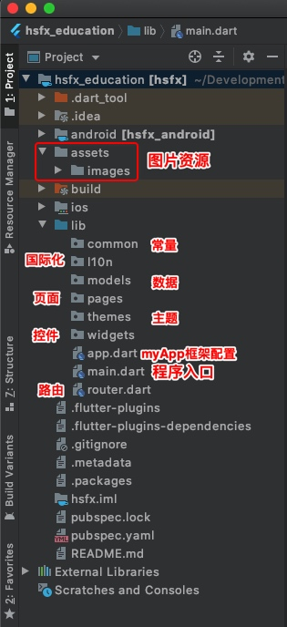

# flutter项目组织结构

主要参考 flutter官方 [gallery](https://github.com/flutter/gallery) 组织结构：
**assets/images：** 存放图片相关资源
**common:** 常量(constants)
**lib：** 目录为flutter主要编程目录
**l10n：** 国际化/本地化
**pages:** 页面
**widgets：** 组件/控件视图
**themes:** 主题
**router.dart** 路由文件
**main.dart** 程序入口 